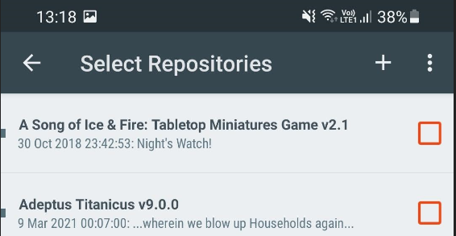
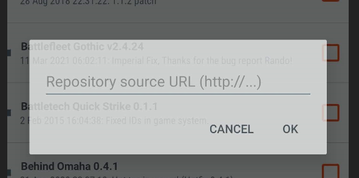
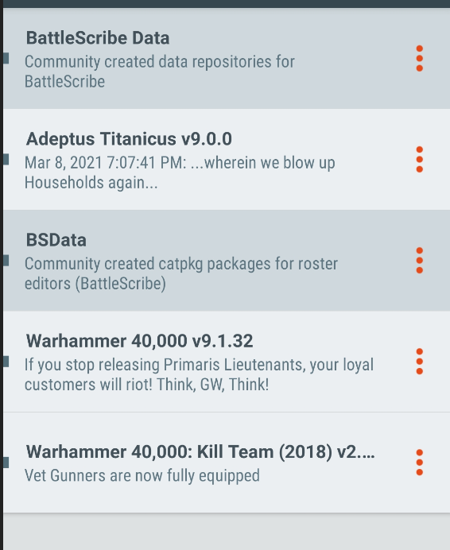
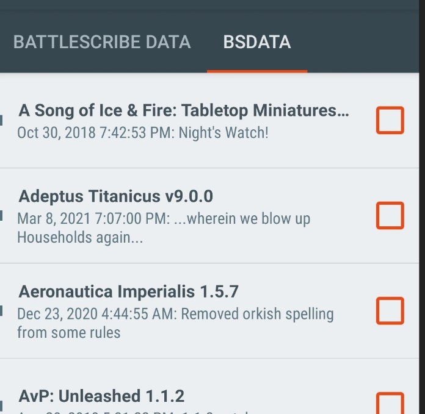

## Android

1. Open Battlescribe.

2. Select "Manage Data"

3. Tap on the big orange plus at the bottom right.

4. Tap the small plus at the top right on the Select Repositories page.

4. Enter the following URL in the repository source URL - https://github.com/BSData/gallery/releases/latest/download/bsdata.catpkg-gallery.json and click OK.

5. On the Manage Data screen, you should now see two light grey entries, "Battlescribe Data" and "BSData".

6. Tap the big orange plus, then select BSData at the top.

7. Select Grimdark Future from the list, then tap the back arrow in the top left.

8. You should be prompted to update your data, but if not, select "Refresh data" to pull the files down.

