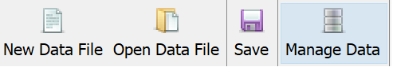
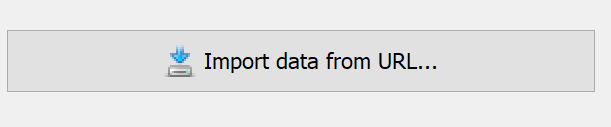
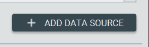
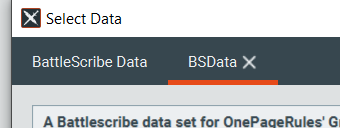

# Desktop

1. Open Battlescribe
2. Click "Manage Data"

3. Click "Import data from URL..."

4. Add the index URLand click OK

5. You should see the index added like so

6. Click "Update data" to pull the files down

