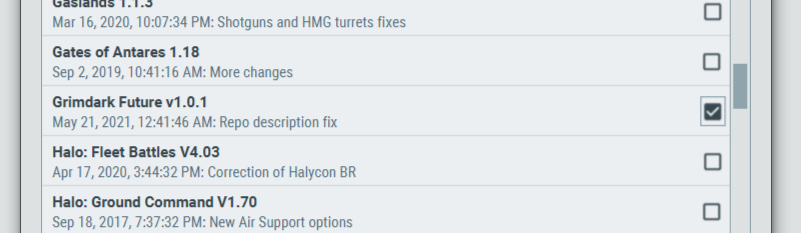
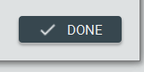
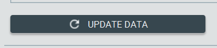

# Desktop

1. Open the Battlescribe Roster Editor

2. Click "Manage Data"

3. Click "Add Data"

4. Click "Add Data Source"

5. Enter the following URL - https://github.com/BSData/gallery/releases/latest/download/bsdata.catpkg-gallery.json - and click OK

6. Click on the new "BSData" tab

7. Find Grimdark Future (and any other systems you want) in the list and check it

8. Click "Done"

9. Click "Update data" to pull the files down

