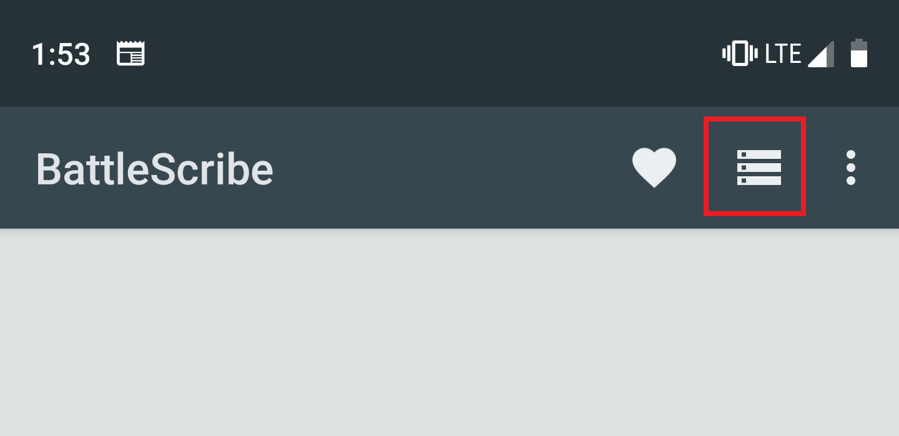
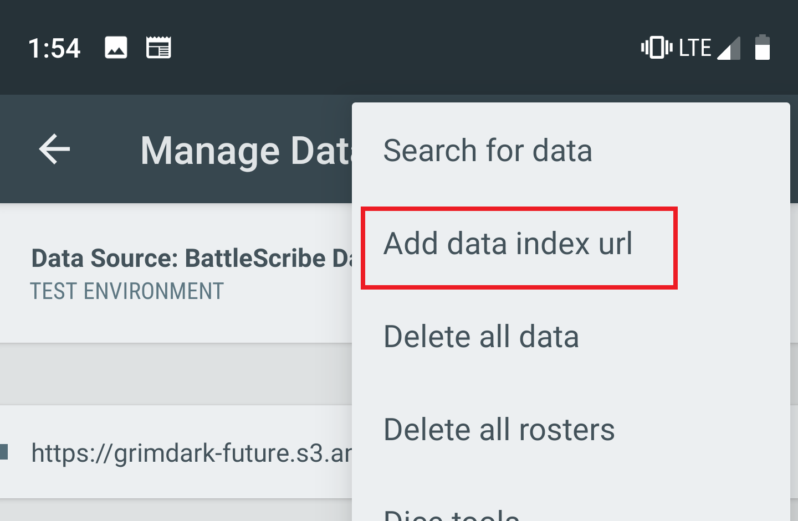
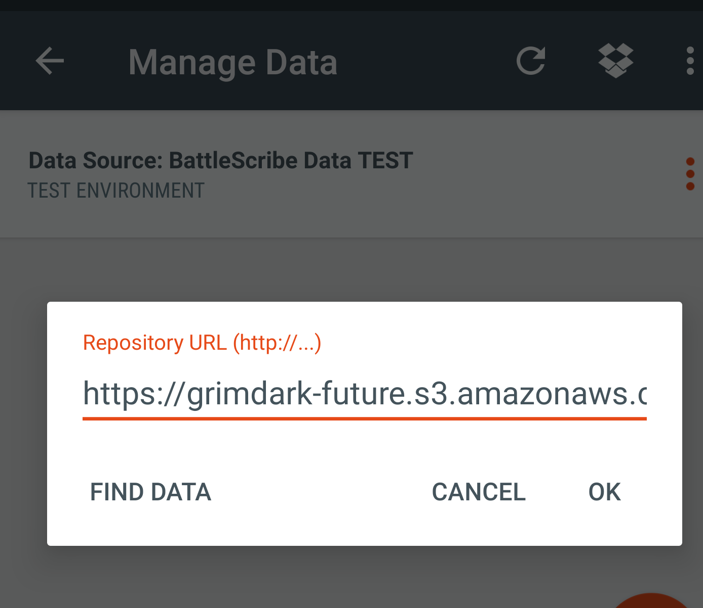
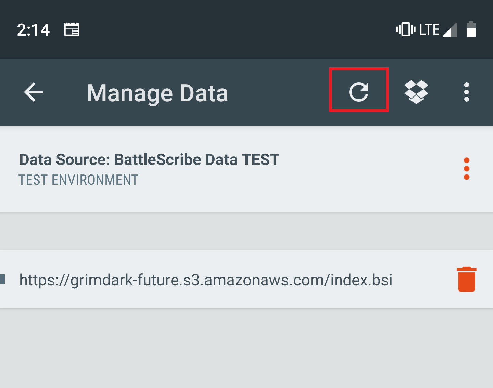

## Mobile

1. Open Battlescribe
2. Select "Manage Data"

3. Select the three dots, then "Add data index url"

4. Enter the index URL and select OK

5. Select "Refresh data" to pull the files down

